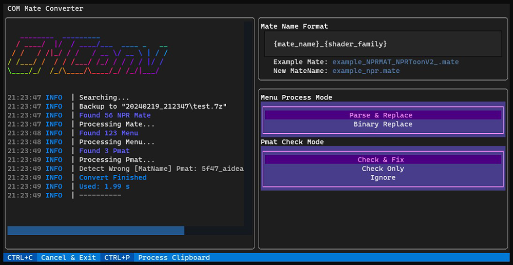

# com-mate-converter

A tool to convert NPRShader Mate to common format for [ShaderServer](https://github.com/krypto5863/COM3D2.ShaderServant).

## Install

Go to [Releases](https://github.com/silver1145/com-mate-converter/releases) and choose the following two installation methods:

1. Download the prepackaged `COM_Mate_Converter-{version}.zip`
   (Only Support Windows 10/11 x64)
2. Download the `com_mate_converter-{version}-py3-none-any.whl`
   Install Python (**>=3.8**) and use command `pip install com_mate_converter-{...}.whl` to install it.
   (Note that Windows only support to Python 3.8)

## Usage

1. Start cmc.exe directly if your default terminal is Windows Terminal. Otherwise, use `start_with_wt.bat` to start.
   
2. Set the options on the right as needed:
   * `Mate Name Format`: New mate naming template.
     The following macros are supported:
     {mate_name}, {shader_family}, {shader_name}
     Their capitalized forms:
     {MATE_NAME}, {SHADER_FAMILY}, {SHADER_NAME}
   * `Menu Process Mode`: Provides two replacement modes.
     The former parses the entire Menu and then replaces the fields, and can completely eliminate the untruncated data in the Menu.
     The latter simply processes with binary replacement. Additional replacements may occur due to the presence of untruncated data.
     The efficiency of the two has not been tested in detail.
   * `Pmat Check Mode`: If to detect Pmat or fix them
     Due to changes in COM3D2 2.34, the Pmat cache table is no longer pre-built. The Pmat filename now must match the value 2 (pmat field) in Mate.
     This check will detect the filename and material name of Pmat. If one of them is referenced by mate and the other is not, it means a wrong Pmat.
3. Start to Process mods.
   Before to do that, **Backups** to **Mate/Menu/Pmat** should be made.
   **Although the converter provides backup, the mod file will still be <font color="#dd0000">corrupted</font> if you <font color="#dd0000">exit / terminate</font> the program during processing**
   * Processing directory: It can be a mods path or a single mod folder.
     But for some **referenced mods**, processing them separately will cause other Menu that reference these Mate to not work.

   Drag and drop the processing directory onto the converter window.
   If your terminal does not support drag-and-drop operations, copy the path to the processing directory and use the shortcut Ctrl+P in the converter window for processing.
4. Make **final confirmation** of the conversion options and press the OK button to start processing.
5. The converter will first obtain all NPR Mates and perform backup. Then convert these Mates into SS universal format, and store the successfully converted Mate list to `new_file_list.txt` in the backup directory.
   The Menu and Pmat is then processed. Since it is not certain whether a Menu/Pmat has been changed, the backup and processing are performed at the same time. But the backup is written to the file at the end.
6. End processing.

## About Recovery from Backup of Converter

1. Open the backup directory for the corresponding time.
2. Use the following commands and scripts to delete newly created files.
   Requires Python
   > pip install send2trash
   > python remove_to_trash.py path_to_backup/new_mate_list.txt

   <details>
   <summary>remove_to_trash.py</summary>

    ```python
    import sys
    from pathlib import Path

    import send2trash


    def remove_to_trash(file_path: Path) -> None:
        try:
            send2trash.send2trash(file_path)
        except Exception as e:
            print(f"Error removing '{file_path}'")


    def main() -> None:
        if len(sys.argv) != 2:
            print("Usage: python remove_to_trash.py <input_file>")
            sys.exit(1)

        input_file = sys.argv[1]
        try:
            with open(input_file, "r", encoding="utf-8") as f:
                for line in f:
                    file_path = line.strip()
                    if file_path:
                        remove_to_trash(Path(file_path))
        except FileNotFoundError:
            print(f"Input file '{input_file}' not found.")
        except Exception as e:
            print(f"Error: {e}")


    if __name__ == "__main__":
        main()
    ```

   </details>
3. Extract the files in the compressed package to the original processing directory.
